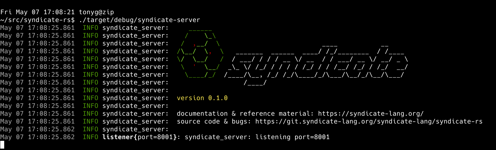

# Syndicate/rs

A Rust implementation of:

 - the Syndicate network protocol, including
 - a high-speed Dataspace indexing structure (see
   [HOWITWORKS.md](https://git.syndicate-lang.org/syndicate-lang/syndicate-rkt/src/commit/90c4c60699069b496491b81ee63b5a45ffd638cb/syndicate/HOWITWORKS.md)
   from `syndicate-rkt`),
 - a standalone Syndicate protocol *broker* service, and
 - a handful of [examples](examples/).

  
*The Syndicate/rs server running.*

## Quickstart

    git clone https://git.syndicate-lang.org/syndicate-lang/syndicate-rs
    cd syndicate-rs
    cargo build --release
    ./target/release/syndicate-server

## Running the examples

In one window, start the server:

    ./target/release/syndicate-server

Then, choose one of the examples below.

### Producer/Consumer (sending messages)

In a second window, run a "consumer" process:

    ./target/release/examples/consumer

Finally, in a third window, run a "producer" process:

    ./target/release/examples/producer

### State producer/consumer (state replication)

Replace `producer` with `state-producer` and `consumer` with
`state-consumer`, respectively, in the instructions of the previous
subsection to demonstrate Syndicate *state replication*.

### Pingpong example (latency)

In a second window, run

    ./target/release/examples/pingpong pong

and in a third window, run

    ./target/release/examples/pingpong ping

The order is important - the difference between `ping` and `pong` is
about who kicks off the pingpong session.

### Performance note

You may find better performance by restricting the server to fewer
cores than you have available. For example, for me, running

    taskset -c 0,1 ./target/release/syndicate-server

roughly *quadruples* throughput for a single producer/consumer pair,
on my 48-core AMD CPU.
